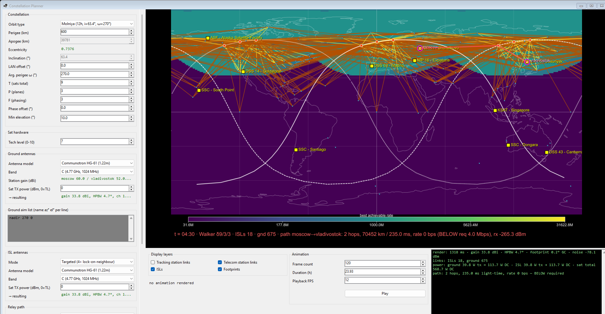

# ConstellationPlanner

A desktop tool for designing satellite constellations for Kerbal Space Program
with the [RealAntennas](https://github.com/KSP-RO/RealAntennas) and
[Skopos](https://github.com/eggrobin/Skopos) mods. Sketch a Walker shell or a
Molniya formation, see ground tracks and coverage at a glance, and check whether
your constellation actually serves the connections Skopos cares about — before
you fly a single sat.



## What it does

- **Pick an orbit shape.** Walker (circular shells), Molniya / Tundra (highly
  elliptical, critical inclination), or fully custom orbital elements.
- **See the coverage map.** Ground tracks, sat sub-points, antenna footprints,
  and ISLs overlay onto a rotating Earth.
- **Check Skopos service.** Point at your `telecom.cfg`, pick any defined
  connection, and the planner shows how well your constellation delivers it
  right now and over a full ground-track cycle.
- **Multi-connection capacity.** Evaluate every Skopos connection at once with
  shared bandwidth + transmit-power accounting, so you can spot when one
  connection starves another.
- **Animate a full cycle.** Step through one ground-track repeat with
  cycle-aware loop closure; uptime, mean latency, and ISL bandwidth stats
  sit in the green status panel alongside.

## Get it running

Grab the latest **self-contained** zip from
[Releases](https://github.com/chambm/ConstellationPlanner/releases), extract
anywhere, and run `ConstellationPlanner.Gui.exe`. No .NET install required —
the runtime is bundled.

If you already have .NET 8 (or newer) installed, the smaller **framework**
zip works the same way.

The planner looks for `telecom.cfg` at the default Steam install path. If your
KSP is somewhere else, the connection dropdown's "(browse for telecom.cfg…)"
entry at the bottom lets you point us at the right file — the path is
remembered between sessions.

## Build from source

```
dotnet build
dotnet run --project ConstellationPlanner.Gui
```

Requires the .NET 8 SDK (or newer). Windows only for the GUI; the underlying
math kernel and CLI are cross-platform.

## More

- [Architecture](docs/architecture.md) — code layout, math kernel,
  source-provenance notes.
- [Skopos parity](docs/skopos-parity.md) — exactly how the relay matches and
  diverges from Skopos's in-game `Routing.FindChannels`.
- Issues and ideas: <https://github.com/chambm/ConstellationPlanner/issues>

## License

MIT.
